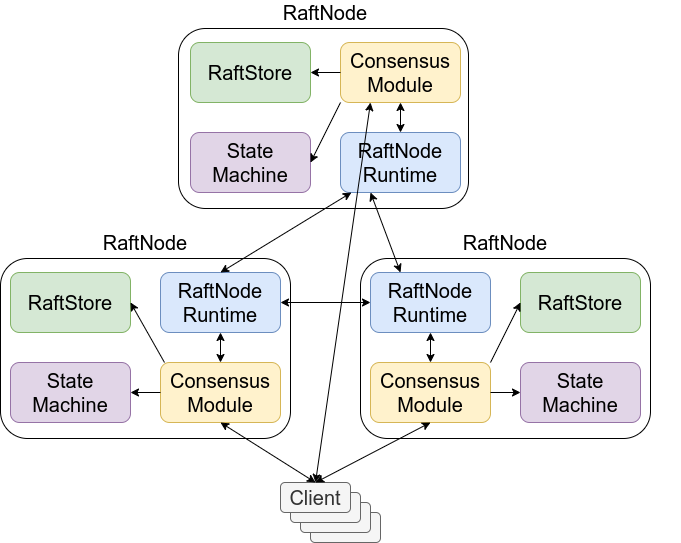

# MicroRaft

## Overview

MicroRaft is a future-complete, stable and production-grade implementation of 
the Raft consensus algorithm in Java. It requires Java 8 at minimum. It can be 
used for building fault tolerant and strongly-consistent (CP) data, metadata 
and coordination services. A few examples of possible use-cases are building
distributed file systems, distributed lock services, key-value stores, etc.

Consensus is one of the fundamental problems in distributed systems, involving
multiple servers agree on values. Once a value is decided, the decision is 
final. Majority-based consensus algorithms, such as Raft, make progress when 
the majority (i.e., more than half) of the servers are up an running and never 
return incorrect values.

Raft uses a replicated log to order requests sent by clients and apply them on
a set of state machine replicas in a coordinated, deterministic and fault 
tolerant manner (i.e., replicated state machines). For more details, please see 
[In Search of an Understandable Consensus Algorithm](https://raft.github.io/raft.pdf) 
by Diego Ongaro and John Ousterhout. 

MicroRaft works on top of a minimalistic and modular design. It consists of 
an isolated implementation of the Raft consensus algorithm and a set of 
accompanying abstractions to run it in a multi-threaded and distributed 
environment. These abstractions are defined to isolate the core Raft logic from
the concerns of persistence, thread-safety, serialization, networking, and
execution of committed operations. Users must provide their own implementations
of these abstractions.

MicroRaft implements the leader election, log replication, log compaction, and 
cluster membership changes components of the Raft consensus algorithm. 
Additionally, it offers the following optimizations and enhancements:

* Pipelining and batching during log replication,
* Back pressure to prevent OOMEs on Raft leader and followers,
* Parallel snapshot chunk transfer from Raft leader and followers,  
* Pre-voting and leader stickiness [(4 Modifications for Raft Consensus)](https://openlife.cc/system/files/4-modifications-for-Raft-consensus.pdf),
* Auto-demotion of Raft leader on loss of quorum heartbeats,
* Linearizable quorum reads without appending log entries [(Section 6.4 of the Raft dissertation)](https://github.com/ongardie/dissertation),
* Lease-based local queries on Raft leader [(Section 6.4.1 of the Raft dissertation)](https://github.com/ongardie/dissertation),
* Local queries on Raft followers,
* Parallel disk writes on Raft leader and followers [(Section 10.2.1 of the Raft dissertation)](https://github.com/ongardie/dissertation),
* Leadership transfer [(Section 3.10 of the Raft dissertation)](https://github.com/ongardie/dissertation).


## Who uses MicroRaft?

TBD

## Acknowledgements

MicroRaft originates from 
[the Raft implementation](https://github.com/hazelcast/hazelcast/tree/master/hazelcast/src/main/java/com/hazelcast/cp/internal/raft) 
that empowers Hazelcast IMDG's 
[CP Subsystem module](https://docs.hazelcast.org/docs/latest/manual/html-single/index.html#cp-subsystem),
and includes several improvements on the public API and internals.

## Main abstractions

The main APIs and abstractions of MicroRaft are listed below. 


### RaftConfig

`RaftConfig` contains configuration options related to the Raft consensus 
algorithm and MicroRaft's implementation. 


### RaftNode

A `RaftNode` runs the Raft consensus algorithm as a member of a Raft group. 
A Raft group is a cluster of `RaftNode` instances that runs the Raft consensus
algorithm. `RaftNode` interface contains APIs for replicating operations, 
performing queries, applying membership changes in the Raft group, handling 
Raft RPCs and responses, etc.

A single JVM instance can run multiple `RaftNode`s that belong to different 
Raft groups or even the same Raft group. 

A `RaftNode` uses the `RaftNodeRuntime` abstraction to run the Raft consensus
algorithm on the underlying platform and the `StateMachine` abstraction to run
committed operations on a user-specified state machine. 


### RaftEndpoint

`RaftEndpoint` represents an endpoint that participates to at least one Raft
group and executes the Raft consensus algorithm with a `RaftNode`.
 
`RaftNode` differentiates members of a Raft group with a unique id. Hence, 
MicroRaft users need to provide a unique id for each `RaftEndpoint`. Other than
this information, `RaftEndpoint` implementations can contain custom fields,
such as network addresses, tags, etc, and those information pieces can be
utilized by `RaftNodeRuntime` implementations.


### RaftRole and RaftNodeStatus 

`RaftRole` denotes the roles of `RaftNode`s as specified in the Raft consensus 
algorithm.

`RaftNodeStatus` denotes the statuses of a `RaftNode` during its own and its
Raft group's lifecycle.


### RaftNodeRuntime

`RaftNodeRuntime` enables execution of the Raft consensus algorithm by 
providing capabilities for task scheduling & execution, serialization &
deserialization of Raft messages, and networking.

A `RaftNode` runs in a single-threaded manner. Even if a `RaftNodeRuntime` 
implementation makes use of multiple threads internally, it must ensure 
the serial execution and 
[happens-before relationship](https://docs.oracle.com/javase/specs/jls/se8/html/jls-17.html)
for the tasks submitted by a single `RaftNode`.


### StateMachine

`StateMachine` enables users to implement arbitrary services, such as an atomic 
register or a key-value store, and execute operations on them. 

`RaftNode` does not deal with the actual logic of committed operations. Once
a given operation is committed by Raft, i.e., it is replicated to the majority
of the Raft group, the operation is passed to the provided `StateMachine` 
implementation. It is the `StateMachine` implementation's responsibility to 
ensure deterministic execution of committed operations.
 
The operations committed in a `RaftNode` are executed in the same thread that 
runs the tasks submitted by that `RaftNode`. Since `RaftNodeRuntime` ensures 
the thread-safe execution of `RaftNode` tasks, `StateMachine` implementations 
do not need to be thread-safe.  


### RaftStore and RestoredRaftState

`RaftStore` is used for persisting the internal state of the Raft consensus 
algorithm. Implementations must provide the durability guarantees defined
in the methods of the interface. 

If a `RaftNode` crashes, its state could be read back from persistent storage
and the `RaftNode` could be restored back with `RestoredRaftState`. 
`RestoredRaftState` contains all the necessary information to recover a 
`RaftNode` from a failure.

> :information_source: `RaftStore` does not persist internal state of 
>`StateMachine` implementations. Upon recovery, a `RaftNode` discovers 
> the current commit index and re-executes all of the operations in the Raft
> log up to the commit index.


### RaftModel, RaftMessage and RaftModelFactory

`RaftModel` is the base interface for the objects that hit network and 
persistent storage. There are 2 other interfaces extending this interface:
`BaseLogEntry` and `RaftMessage`. `BaseLogEntry` is used for representing
log and snapshot entries stored in the Raft log. `RaftMessage` is used for 
Raft RPCs and their responses. Please see the interfaces inside 
`io.microraft.model` for more details. In addition, there is a 
`RaftModelFactory` interface for creating `RaftModel` objects. Users of 
MicroRaft must provide an implementation of this interface during 
initialization of `RaftNode`s. 

In short, users of MicroRaft can create their own representation of 
the `RaftModel` objects and implement the networking and persistence concerns
behind the `RaftNodeRuntime` and `RaftStore` interfaces.   

 
## Architectural overview of a Raft group

The following figure depicts an architectural overview of a Raft group based on
the abstractions explained above.


 
 
## How to Use MicroRaft

In order to run a Raft group (i.e., Raft cluster) using MicroRaft, you need to:

* implement the `RaftEndpoint` interface to denote unique IDs of `RaftNode`s 
you are going to run,
 
* provide a `StateMachine` implementation for your actual state machine logic 
(key-value store, atomic register, etc.),

* implement the `RaftModel` and `RaftModelFactory` interfaces to create Raft 
RPC request and response objects and Raft log entries,
    
* provide a `RafNodeRuntime` implementation to realize task execution, 
serialization of your `RaftModel` objects and networking, 

* __(optional)__ provide a `RaftStore` implementation if you want to restore
failed `RaftNode`s. You can persist the internal `RaftNode` state to stable
storage via the `RaftStore` interface and recover from `RaftNode` failures by
restoring persisted Raft state. Otherwise, you could use the already-existing
`io.microraft.persistence.NopRaftStore` utility which makes the internal Raft
state volatile and disables crash-recovery, i.e, recovery of failed 
`RaftNode`s. If persistence is not implemented, failed `RaftNode`s cannot be 
restarted and they need to be removed from the Raft group to not to damage 
availability.

* :information_source: build a discovery and RPC mechanism to replicate and
commit your operations on a Raft group. This is required because simplicity is
the primary concern for MicroRaft's design philosophy. MicroRaft offers a 
minimum API set to cover the fundamental functionality and enable its users to
implement higher-level abstractions, such as an RPC system with routing, 
retries, deduplication, etc. For instance, MicroRaft does not broadcast 
the Raft group members to any external discovery system, or it does not 
integrate with any observability tool, but it exposes all necessary 
information, such as the current Raft group members, the leader endpoint, term,
commit index, etc. via `RaftNode.getReport()`. You can use that information
to feed your discovery system and monitoring tools. Relatedly, the public APIs 
on `RaftNode` do not employ request routing or retry mechanisms. For instance, 
if a client tries to replicate an operation via a follower or a candidate 
`RaftNode`, the returned `CompletableFuture` object is simply notified with 
`NotLeaderException`, instead of internally forwarding the operation to 
the leader `RaftNode`. `NotLeaderException` also contains `RaftEndpoint` of 
the current leader so that the client can send its request to the leader 
`RaftNode`. 


### How to Bootstrap a Raft Group

Before starting a Raft group, you first decide on its initial member list, 
i.e., the list of Raft endpoints. The identical initial Raft group member list 
must be provided to all `RaftNode`s.

The following code shows how to create a 3-member Raft group in a single JVM.

```

RaftEndpoint member1 = ... 
RaftEndpoint member2 = ... 
RaftEndpoint member3 = ...

List<RaftEndpoint> initialGroupMembers = Arrays.asList(member1, member2, member3);

List<RaftNode> raftNodes = new ArrayList<>();
for (RaftEndpoint endpoint : initialGroupMembers) {
    RaftNodeRuntime runtime = ... // create Raft node runtime for this endpoint
    StateMachine stateMachine = ... // create state machine for this endpoint

    RaftNode raftNode = RaftNode.newBuilder()
                                .setInitialGroupMembers(initialGroupMembers)
                                .setLocalEndpoint(member1)
                                .setRuntime(runtime)
                                .setStateMachine(stateMachine)
                                .build();
    
    raftNode.start(); 
}

```   

When a `RaftNode` is created, its initial status is `RaftNodeStatus.INITIAL` 
and it does not execute the Raft consensus algorithm in this status. When 
`RaftNode.start()` is called, the `RaftNode` moves to `RaftNodeStatus.ACTIVE` 
and it automatically checks if there is a leader already or it should trigger
a new leader election round. Once the leader election is done, operations can
be replicated and queries can be executed on the Raft group. You can learn 
the leader endpoint via `RaftNode.getLeaderEndpoint()`. 

### How to Commit an Operation on the Raft Group

Let's see how to replicate and commit an operation via the Raft group leader. 
Our operation returns a `String` result. 

```

RaftNode leader = ...
Object operation = ...

Future<Ordered<String>> future = leader.replicate(operation);
Ordered<String> result = future.get();

Sytem.out.println("Commit index: " + result.getCommitIndex() + ", result: " + result.getResult());

``` 
 
Most of the `RaftNode` methods, including `RaftNode.replicate()` return 
a `CompletableFuture<Ordered>` object. `Ordered` provides both the result of
the attempted operation and on which committed Raft log index the operation has
been executed.

When `RaftNode.replicate()` is called on a follower or a candidate, 
the returned `CompletableFuture<Ordered>` object is simply notified with 
`NotLeaderException`, which also provides `RaftEndpoint` of the leader 
`RaftNode`. 


### How to Perform a Query

`RaftNode.query()` method executes query (i.e., read-only) operations on 
the Raft group in an efficient manner. MicroRaft differentiates updates and
queries to employ some optimizations for query operations. Namely, it offers
3 policies for queries:

* `QueryPolicy.LINEARIZABLE`: You can perform a linearizable query on 
the leader `RaftNode`. MicroRaft employs the optimization described in 
*Section: 6.4 Processing read-only queries more efficiently* of 
[the Raft dissertation](https://github.com/ongardie/dissertation) to preserve
linearizability without growing the internal Raft log.

* `QueryPolicy.LEADER_LOCAL`: You can run a query locally on the leader 
`RaftNode` without making the leader talk to the followers. If the called 
`RaftNode` is not the leader, the returned `CompletableFuture<Ordered>` object 
fails with `NotLeaderException`. 

* `QueryPolicy.ANY_LOCAL`: You can use this policy to run a query locally on
any `RaftNode` independent of its current Raft role. 


MicroRaft also employs leader stickiness and auto-demotion of leaders on loss 
of quorum heartbeats. Leader stickiness means that a follower does not vote for
another `RaftNode` before the __leader heartbeat timeout__ elapses after 
the last received __AppendEntries__ or __InstallSnapshot__ RPC. Dually, 
a leader `RaftNode` automatically demotes itself to the follower role if it has
not received `AppendEntriesRPC` responses from the majority during the __leader
heartbeat timeout__ duration. Along with these techniques, 
`QueryPolicy.LEADER_LOCAL` can be used for performing linearizable queries 
without talking to the majority if the clock drifts and network delays are 
bounded. However, bounding clock drifts and network delays is not an easy task.
`LEADER_LOCAL` may cause reading stale data if a `RaftNode` still considers 
itself as the leader because of a clock drift even though the other `RaftNode`s 
have elected a new leader and committed new operations. Moreover, 
`LEADER_LOCAL` and `LINEARIZABLE` policies have the same processing cost since
only the leader `RaftNode` runs a given query for both policies. `LINEARIZABLE`
policy guarantees linearizability with an extra cost of 1 RTT latency overhead
compared to the `LEADER_LOCAL` policy. For these reasons, `LINEARIZABLE` is 
the recommended policy for linearizable queries and `LEADER_LOCAL` should be 
used with care. 

Nevertheless, `LEADER_LOCAL` and `ANY_LOCAL` policies can be easily used if 
monotonicity is sufficient for the query results returned to the clients. 
A client can track the commit indices observed via the returned `Ordered` 
objects and use the highest observed commit index to preserve monotonicity
while performing a local query on a `RaftNode`. If the local commit index of
a `RaftNode` is smaller than the commit index passed to the `RaftNode.query()` 
call, the returned `CompletableFuture` object fails with 
`LaggingCommitIndexException`. The client can send its query to another 
`RaftNode` upon receiving this exception.

Please refer to 
[Section 6.4.1 of theRaft dissertation](https://github.com/ongardie/dissertation)
for more details.


```

long highestObservedCommitIndex = ...

CompletableFuture<Ordered<String>> future = follower.query(operation, QueryPolicy.ANY_LOCAL, highestObservedCommitIndex);
Ordered<String> result = future.get(); 

```   

### How to Restore a Crashed Raft Node 

MicroRaft contains the `RaftStore` interface which is a contract for persisting 
internal Raft state to storage. However, MicroRaft does not provide any actual
persistence implementation. You need to write your own `RaftStore` 
implementation to be able to recover from JVM or machine crashes. Your custom 
persistence implementation must satisfy all the durability guarantees defined 
in the `RaftStore` interface in order to preserve the safety properties of 
the Raft consensus algorithm.

If you need to terminate a `RaftNode`, for instance, because you will move that
`RaftNode` to another machine, you can move the `RaftNode` to 
`RaftNodeStatus.TERMINATED` status via `RaftNode.terminate()`. Please note that 
its termination just makes it unavailable to the other `RaftNode`s since it 
will only stop executing the Raft consensus algorithm, however it will be still
in the Raft group member list. Once the `RaftNode` is terminated, you can move
its persisted data to the new server and restart it.

To recover a crashed or terminated `RaftNode`, you can restore its persisted 
state from the storage layer into a `RestoredRaftState` object. Then, you can 
use this object to create the `RaftNode` back. 

``` 

RaftNodeRuntime runtime = ... // create Raft node runtime 
StateMachine stateMachine = ... // create state machine 
RestoredRaftState restoredState = ... // restore state from storage

RaftNode raftNode = RaftNode.newBuilder()
                            .setRestoredState(restoredState)
                            .setRuntime(runtime)
                            .setStateMachine(stateMachine)
                            .build();
    
raftNode.start(); 

```

> :warning: When a `RaftNode` is created with a restored Raft state, it 
> discovers the current commit index of the Raft group and replays the Raft 
> log, i.e., automatically applies all of the log entries up to the commit 
> index. You should be careful about the operations that have side-effects
> because the Raft log replay triggers those side-effects again.

> :warning: If `RaftNode`s are not created with an actual `RaftStore` 
> implementation in the beginning, restarting crashed `RaftNode`s with the same
> `RaftEndpoint` identity can break the safety of the Raft consensus algorithm. 
> When there is no persistence layer, the only recovery option for a failed 
> `RaftNode` is to remove it from the Raft group.
  

### How to Change Member List of a Raft Group

MicroRaft supports membership changes in Raft groups via 
the `RaftNode.changeMembership()` method.

> :information_source:  Raft group membership changes are appended to 
> the internal Raft log as custom log entries and committed just like 
> user-supplied operations. Therefore, Raft group membership changes require
> the majority of the Raft group to be operational. 

When a membership change is committed, its commit index is used to denote 
the new member list of the Raft group and called 
__group members commit index__. When a new membership change is triggered via 
`RaftNode.changeMembership()`, the current __group members commit index__ must 
be provided as well. 

MicroRaft allows one Raft group membership change at a time and more complex 
changes must be applied as a series of single changes. Suppose you have a 
3-member Raft group and you want to improve its degree of fault tolerance by
adding 2 new members (majority of 3 = 2 -> majority of 5 = 3). 

```
RaftEndpoint member1 = ... 
RaftEndpoint member2 = ... 
RaftEndpoint member3 = ...

List<RaftEndpoint> initialGroupMembers = Arrays.asList(member1, member2, member3);

// We have our first 3 RaftNode instances up and running

RaftEndpoint member4 = ...

RaftNode leader = ...

// group members commit index of the initial Raft group members is 0.
CompletableFuture<Ordered<RaftGroupMembers>> future1 = leader.changeMembership(member4, MembershipChangeMode.ADD, 0);

Ordered<RaftGroupMembers> groupMembersAfterFirstChange = future1.get();

// Our RaftNode is added to the Raft group. We can start it now. Notice that
// we need to provide the initial Raft group member list to this new `RaftNode`
instance.

RaftNode raftNode4 = RaftNode.newBuilder()
                             .setInitialGroupMembers(initialGroupMembers)
                             .setLocalEndpoint(member4)
                             .setRuntime(...)
                             .setStateMachine(...)
                             .build();
                             
raftNode4.start();

// Now our Raft group has 4 members, whose majority is 3. It means that the new
// RaftNode does not make a difference in terms of the degree of fault 
// tolerance. We will just add one more RaftNode.  

RaftEndpoint member5 = ...

// here, we provide the commit index of the current Raft group member list.
CompletableFuture<Ordered<RaftGroupMembers>> future2 = leader.changeMembership(member5, MembershipChangeMode.ADD
, groupMembersAfterFirstChange.getCommitIndex());

future2.get();

// 5th RaftNode is also added to the Raft group. The majority is 3 now and we
// can tolerate failure of 2 RaftNode instances.

RaftNode raftNode5 = RaftNode.newBuilder()
                             .setInitialGroupMembers(initialGroupMembers)
                             .setLocalEndpoint(member4)
                             .setRuntime(...)
                             .setStateMachine(...)
                             .build();

raftNode5.start();

```

Similarly, crashed `RaftNode`s can be removed from the Raft group. In order to
replace a non-recoverable `RaftNode` without hurting the overall availability
of the system, you should remove the crashed `RaftNode` first and then add 
a new `RaftEndpoint` to the Raft group. 


## Fault Tolerance

The availability of a Raft group depends on if the majority (i.e., more than 
half) of the `RaftNode`s are alive or not. For instance, a 3-member Raft group
can tolerate failure of 1 `RaftNode` and still remain available. Similarly, 
a 5-member Raft group can tolerate failure of 2 `RaftNode`s and remain 
available. 

> :information_source: In terms of safety, the fundamental guarantee of 
> the Raft consensus algorithm and hence MicroRaft is, operations are committed
> in a single global order, and a committed operation is never lost, as long as
> there is no Byzantine failure in the system.


### Minority Failure

Based on the reasoning above, failure of the minority (i.e, less than half) of 
the `RaftNode`s does not hurt availability of the Raft group. The Raft group
continues to accept and commit new requests. If you have a persistence-layer
implementation (i.e, `RaftStore`), you can try to recover failed `RaftNode`s. 
If you don't have a persistence-layer or cannot recover the persisted Raft 
data, you can remove failed `RaftNode`s from the Raft group. Please note that
when you remove a `RaftNode` from a Raft group, the majority value will be 
re-calculated based on the new size of the Raft group.


### Majority Failure

Based on the reasoning above, failure of the majority causes the Raft group to
lose its availability and stop handling new requests. The only recovery option 
is to recover some of the failed `RaftNode`s so that the majority becomes 
available again. Otherwise, the Raft group cannot be recovered. MicroRaft does 
not support an unsafe recovery policy for now. 

> :warning: Please note that you need to have a persistence-layer to make this
> recovery option work. 


### Raft Leader Failure

When the current leader of the Raft group fails, the Raft group temporarily
loses its availability until the other `RaftNode`s notice the failure and
elect a new leader. 

If a Raft leader fails before a client receives response for an operation 
passed to the `RaftNode.replicate()` method, there are multiple possibilities:
 
- If the leader failed before replicating the given operation to any follower, 
then the operation is certainly not committed and hence it is lost. 

- If the failed leader managed to replicate the given operation to at least one
follower, then that operation might be committed if that follower wins the new 
election. However, another follower could become the new leader and overwrite 
that operation. 

> :warning: It is up to the client to retry a operation whose result is not 
> received, because a retry could cause the operation to be committed twice 
> based on the actual failure scenario. MicroRaft goes for simplicity and does
> not employ deduplication. If deduplication is needed, it can be implemented
> inside the operation objects passed to `RaftNode.replicate()`.  

Raft leaders use a heartbeat mechanism to denote their liveliness. Followers do
not trigger a new leader election round as long as the current leader continues
to send `AppendEntries` RPCs. The Raft paper uses a single parameter, 
__election timeout__, to both detect failure of the leader and perform a leader 
election round. A follower decides the current leader to be crashed if the
__election timeout__ duration passes after its last `AppendEntriesRPC`. 
Moreover, a candidate starts a new leader election round if the __election 
timeout__ elapses before it acquires the majority votes or another candidate 
announces the leadership. The Raft paper discusses the __election timeout__ to 
be configured around 500 milliseconds. Even though such a low timeout value
works just fine for leader elections, we have experienced that it causes false
positives for failure detection of the leader when there is a hiccup in 
the system. When a leader slows down temporarily for any reason, its followers 
may start a new leader election round very quickly. To prevent such problems
and allow users to tune availability of the system with more granularity,
MicroRaft uses 2 timeout configurations: __leader heartbeat timeout__, which is
specified by `RaftConfig.getLeaderHeartbeatTimeoutMillis()` and 10 seconds by
default, to detect failure of the leader and __leader election timeout__, which
is specified by `RaftConfig.getLeaderElectionTimeoutMillis()` and 500 
milliseconds by default, to terminate the current leader election round and 
start a new one. If both values are configured the same, MicroRaft's behaviour
becomes identical to the behaviour described in the Raft paper. Please note
that having 2 timeout parameters does not make any difference in terms of 
the safety property. 


### Network Partition

Behaviour of a Raft group during a network partition depends on how `RaftNode`s
are divided in different sides of the network partition and with which 
`RaftNode`s you are interacting with. If any subset of the `RaftNode`s manage 
to form the majority, they remain available. If the Raft leader before 
the network partition is not present in the majority side, the `RaftNode`s 
in the majority side elect a new leader and restore their availability.
    
If the leader falls into a minority side of the network partition, it demotes
itself to the follower role after __the leader heartbeat timeout__, and fails 
all pending operations with `IndeterminateStateException`. This exception means
that the demoted leader cannot decide if those operations have been committed 
or not. 
 
When the network problem is resolved, the `RaftNode`s connect to each other 
again.`RaftNode`s that was on a minority side of the network partition catch up
with the other `RaftNode`s and the Raft group continues its normal operation.    

> :information_source: The most important point of the Raft consensus 
> algorithm's and hence MicroRaft's network partition behaviour is the absence
> of split-brain. In any network partition scenario, there can be at most one
> Raft leader handling and committing operations.


### Corruption or Loss of the Persisted Raft State

If a `RestoredRaftState` object is created with corrupted or partially-lost
Raft state, the safety guarantees of the Raft consensus algorithm no longer 
holds. For instance, if a flushed (`io.microraft.persistence.RaftStore#flush()`) 
log entry is not present in the `RestoredRaftState` object, then it can cause 
to lose a committed operation and break determinism of the `StateMachine`.

> :warning: It is the responsibility of `RaftStore` implementations to ensure 
> durability and integrity of the persisted Raft state. `RaftNode`s do not 
> perform any checks when they are restored with `RestoredRaftState` objects.    

