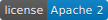

 

MicroRaft is a feature-complete, stable and production-grade open-source 
implementation of the Raft consensus algorithm in Java. __It is a single 
lightweight JAR file of a few hundred KBs of size.__ It requires Java 8 
at minimum. It can be used for building fault tolerant and strongly-consistent 
(CP) data, metadata and coordination services. A few examples of possible 
use-cases are building distributed file systems, distributed lock services, 
key-value stores, etc.

## Features

MicroRaft implements the leader election, log replication, log compaction 
(snapshotting), and cluster membership changes components of the Raft consensus
algorithm. Additionally, it offers a rich set of optimizations and 
enhancements:

* Pipelining and batching during log replication,
* Back pressure to prevent OOMEs on Raft leader and followers,
* Parallel snapshot transfer from Raft leader and followers,
* Pre-voting and leader stickiness [(4 Modifications for Raft Consensus)](https://openlife.cc/system/files/4-modifications-for-Raft-consensus.pdf),
* Auto-demotion of Raft leader on loss of quorum heartbeats,
* Linearizable quorum reads without appending log entries [(Section 6.4 of the Raft dissertation)](https://github.com/ongardie/dissertation),
* Lease-based local queries on Raft leader [(Section 6.4.1 of the Raft dissertation)](https://github.com/ongardie/dissertation),
* Monotonic local queries on Raft followers [(Section 6.4.1 of the Raft dissertation)](https://github.com/ongardie/dissertation),
* Parallel disk writes on Raft leader and followers [(Section 10.2.1 of the Raft dissertation)](https://github.com/ongardie/dissertation),
* Leadership transfer [(Section 3.10 of the Raft dissertation)](https://github.com/ongardie/dissertation).

## Getting Started

See [the Getting Started Guide](https://microraft.io/user-guide/getting-started)

## Building from Source

Pull the latest code with `git clone git@github.com:metanet/MicroRaft.git` 
and build with `cd MicroRaft && ./mvnw clean package`. 

## Source Code Layout 

`microraft` module contains the source code of MicroRaft along with its unit 
and integration test suite. 

`microraft-hocon` and `microraft-yaml` modules are utility libraries for 
parsing HOCON and YAML files to start Raft nodes. 

`microraft-io` contains the source files of 
the [microraft.io](https://microraft.io) website.

## Contributing to MicroRaft

MicroRaft is a new open source project with tons of work to do! You can see 
[this guide](CONTRIBUTING.md) for contributing to MicroRaft.

## License

MicroRaft is available under [the Apache 2 License](https://github.com/metanet/MicroRaft/blob/master/LICENSE). 

