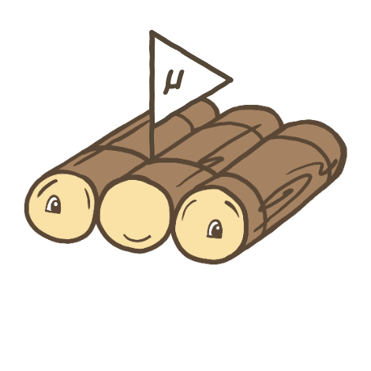

# MicroRaft

{: style="height:192px;width:192px;float:right;"}

MicroRaft is a feature-complete and stable open-source implementation of the
Raft consensus algorithm in Java. It is released with
<a href="https://github.com/MicroRaft/MicroRaft/blob/master/LICENSE"
target="_blank">the Apache 2 license</a>.

MicroRaft works on top of a minimalistic and modular design. __It is a single
lightweight JAR with a few hundred KBs of size and only logging dependency__. It
contains an isolated implementation of the Raft consensus algorithm, and a set
of accompanying interfaces to run the algorithm in a multi-threaded and
distributed environment. These interfaces surround the Raft consensus algorithm,
and abstract away the concerns of persistence, thread-safety, serialization,
networking and actual state machine logic. Developers are required to implement
these interfaces to build *CP* distributed systems on top of MicroRaft.

You can read the [public announcement](blog/2021-09-03-introducing-microraft.md)
here.

## Features

MicroRaft is a complete implementation of the Raft consensus algorithm. It
implements the leader election, log replication, log compaction (snapshotting),
and cluster membership changes components. Additionally, it realizes a rich set
of optimizations and enhancements, as listed below, to allow developers to run
Raft clusters in a reliable and performant manner, and tune its behaviour based
on their needs.

* Adaptive batching during log replication
* Back pressure to prevent OOMEs on Raft leader and followers
* Parallel snapshot transfer from Raft leader and followers
* Pre-voting and leader stickiness (<a href="https://github.com/ongardie/dissertation" target="_blank">§ 4.2.3 and 9.6 of the Raft dissertation</a>, and <a href="https://openlife.cc/system/files/4-modifications-for-Raft-consensus.pdf" target="_blank">4 Modifications for Raft Consensus</a>)
* Auto-demotion of Raft leader on loss of quorum heartbeats
* Linearizable quorum reads without appending log entries <a href="https://github.com/ongardie/dissertation" target="_blank">(§ 6.4 of the Raft dissertation)</a>
* Lease-based local queries on Raft leader <a href="https://github.com/ongardie/dissertation" target="_blank">(§ 6.4.1 of the Raft dissertation)</a>
* Monotonic local queries on Raft followers <a href="https://github.com/ongardie/dissertation" target="_blank">(§ 6.4.1 of the Raft dissertation)</a>
* Parallel disk writes on Raft leader and followers <a href="https://github.com/ongardie/dissertation" target="_blank">(§ 10.2.1 of the Raft dissertation)</a>
* Leadership transfer <a href="https://github.com/ongardie/dissertation" target="_blank">(§ 3.10 of the Raft dissertation)</a>
* <a href="https://basri.dev/posts/2020-07-27-improved-majority-quorums-for-raft/" target="_blank">Improved majority quorums</a>

## Use cases

MicroRaft can be used for building highly available and strongly consistent
data, metadata and coordination services.

An example of data service is a distributed key-value store. You can build a
distributed key-value store where each partition / shard is maintained by a
separate Raft cluster (*Raft group* in MicroRaft terms).

MicroRaft can be also used for building a control plane or coordination cluster.
It can store the metadata of your large-scale data services. High-level APIs,
such as leader election mechanisms, group membership management systems,
distributed locks, distributed transaction managers, or distributed resource
schedulers can be also built on top of MicroRaft.

__Please note that MicroRaft is not a high-level solution like a distributed
key-value store, or a distributed lock service. It is a library that offers a
set of abstractions and functionalities to help you build such high-level
systems without intertwining your system with Raft code.__

## Getting started

Just run the following command on your terminal for a sneak peek at MicroRaft.
It starts a 3-node local Raft group, elects a leader, and commits a number of
operations.

~~~~{.bash}
$ gh repo clone MicroRaft/MicroRaft && cd MicroRaft && ./mvnw clean test -Dtest=io.microraft.tutorial.OperationCommitTest -DfailIfNoTests=false -Ptutorial
~~~~

If you want to learn more about how to use MicroRaft for building a *CP*
distributed system, you can check out the [Main
Abstractions](docs/main-abstractions.md) section first, and then read the
[tutorial](docs/tutorial-building-an-atomic-register.md) to build an atomic
register on top of MicroRaft.

## Getting involved

MicroRaft is a new open-source library. Your contribution and feedback is 
welcome! The development happens on <a href="https://github.com/MicroRaft/MicroRaft"
target="_blank">Github</a>. You can follow <a href="https://twitter.com/microraft" 
target="_blank">@MicroRaft</a> on Twitter for announcements.

## What is consensus?

Consensus is one of the fundamental problems in distributed systems. It involves
multiple servers agree on a value. Once a value is decided, the decision is
final. Consensus algorithms are very useful in a plethora of distributed systems
that require high availability and strong consistency. Paxos, first introduced
by Leslie Lamport, is probably the most widely known consensus algorithm.
However, it has been also known as difficult to reason about and lacking details
for building practical implementations. Raft was introduced in 2013 as a new
consensus algorithm with the main goal of understandability. Ever since its
introduction, Raft has received widespread adoption in the industry.

Raft approaches the consensus problem in the context of replicated state
machines, where a group of servers applies the same set of operations and
computes identical copies of the same state. Raft's primary enabler of
understandability is the problem decomposition technique. It divides the
consensus problem into 3 pieces: leader election, log replication and safety,
and solves each piece relatively independently. Raft starts by electing a
leader. There is a single functional leader managing the servers, and upon its
failure a new leader is elected. Each server keeps a local log. Clients send
their requests to the leader. The leader appends incoming requests into its log
and replicates them to the other servers. Each server appends the requests sent
by the leader into its log. Once a request is appended to the local logs of
sufficient number (i.e., more than half) of servers, the leader considers the
request committed, hence executes it on its local state machine, also notifies
other servers to do the same. Raft orders requests by the indices they are
appended to the replicated log. In addition, Raft's leader election and log
replication rules ensure that once a request is committed and executed at a
given log index on one server, no other server can execute another request for
the same log index, including the presence of non-Byzantine failures. This is
basically Raft's safety property. Thanks to this property, each server executes
the same sequence of requests. Once these requests are deterministic, servers
compute identical copies of the same state and produce the same output values.

For more details about Raft, please see the [In Search of an Understandable
Consensus Algorithm](https://raft.github.io/raft.pdf) paper by Diego Ongaro and
John Ousterhout.  

## Acknowledgements

MicroRaft originates from Hazelcast IMDG's <a
href="https://github.com/hazelcast/hazelcast/tree/master/hazelcast/src/main/java/com/hazelcast/cp/internal/raft"
target="_blank">Raft implementation</a> and includes several significant
improvements on the public APIs and internals.

MicroRaft's logo is created by modifying <a
href="https://github.com/raft/logo/tree/3d2c4d5ca0d9c4fb8d5c28a82c4a43e576673b06"
target="_blank"> Raft's original logo</a>. Raft's logo was created by Andrea
Ruygt and licensed under <a href="https://creativecommons.org/licenses/by/4.0/"
target="_blank">the Creative Commons Attribution-4.0 International</a>.
